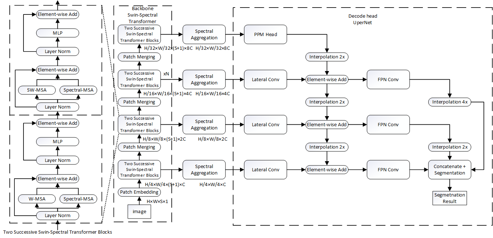
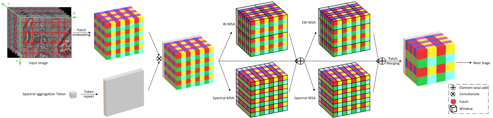

# Swin-Spectral Transformer for Hyperspectral Image Segmentation

This repository is based on MMSegmentation. You can view original README.md for more information:

[English](README_mmsegmentation.md) | [简体中文](README_mmsegmentation_zh-CN.md)

Documentation: https://mmsegmentation.readthedocs.io/


## Introduction
The Swin-Spectral Transformer treats bands in hyperspectral image as sequence 
and uses Spectral-MSA to extract spectral feature. The Spectral-MSA is combined 
with SW-MSA to get spatial information.

Spectral Aggregation token is used to summarize spectral information.   




The Swin-Spectral Transformer is implemented in 
*mmseg/models/backbones/swinspectral.py*.

## License

This project is released under the [Apache 2.0 license](LICENSE).

## Installation

Please refer to [get_started.md](docs/get_started.md#installation) for installation and [dataset_prepare.md](docs/dataset_prepare.md#prepare-datasets) for dataset preparation.

The file structure of HSIDataset is like:
```none
mmsegmentation
├── mmseg
├── tools
├── configs
├── data
│   ├── HSI
│   │   ├── ann_dir
│   │   │   ├── 030406C_2-20x-roi1-L.png
│   │   │   ├── 030406C_2-20x-roi2-L.png
│   │   │   ├── 030406C_2-20x-roi3-L.png
│   │   │   ├── ...
│   │   ├── hdr_dir
│   │   │   ├── 030406C_2-20x-roi1-L.hdr
│   │   │   ├── 030406C_2-20x-roi1-L.raw
│   │   │   ├── 030406C_2-20x-roi2-L.hdr
│   │   │   ├── 030406C_2-20x-roi3-L.raw
│   │   │   ├── 030406C_2-20x-roi3-L.hdr
│   │   │   ├── 030406C_2-20x-roi3-L.raw
│   │   │   ├── ...
│   │   ├── split
│   │   │   ├── split_0_train.txt
│   │   │   ├── split_0_val.txt
│   │   │   ├── split_0_test.txt
│   │   │   ├── ...
```
Filenames in *split_0/1/2/3/4_train/val/test* should not have suffix.

## Get Started

Please see [train.md](docs/train.md) and [inference.md](docs/inference.md) for the basic usage of MMSegmentation.
There are also tutorials for [customizing dataset](docs/tutorials/customize_datasets.md), [designing data pipeline](docs/tutorials/data_pipeline.md), [customizing modules](docs/tutorials/customize_models.md), and [customizing runtime](docs/tutorials/customize_runtime.md).
We also provide many [training tricks](docs/tutorials/training_tricks.md) for better training and [usefule tools](docs/useful_tools.md) for deployment.

##### commads
The training command for Swin-Spectral Transformer is like:
```shell script
python tools/train_folds.py \
configs_hsi/swin/upernet_swin_base_patch4_window7_4k_hsi.py \
--work-dir workdir/upernet_swin_base_patch4_window7_4k_hsi_fold{} \
--folds 5
```

The testing command for Swin-Spectral Transformer is like:
```shell script
python tools/test_folds.py \
configs_hsi/swin/upernet_swin_base_patch4_window7_4k_hsi.py \
workdir/upernet_swin_base_patch4_window7_4k_hsi_fold{}/eval_best.pth \
--eval mIoU mDice --folds=5
```

*train_folds.py* and *test_folds.py* use *--folds=5* to perform 5-fold cross validation.

##### HSIDataset
HSIDataset is a custom dataset defined in *mmseg/datasets/hsi.py*. 
LoadENVIHyperSpectralImageFromFile is a custom loading pipeline defined in 
*mmseg/datasets/pipelines/loading_hsi.py*. This function should be able to 
load ENVI format HyperSpectral Image. But if you meet any question with the
function, you can send an email to 1395133179@qq.com for help.
## Citation

If you find this project useful in your research, please consider cite:

```latex
```